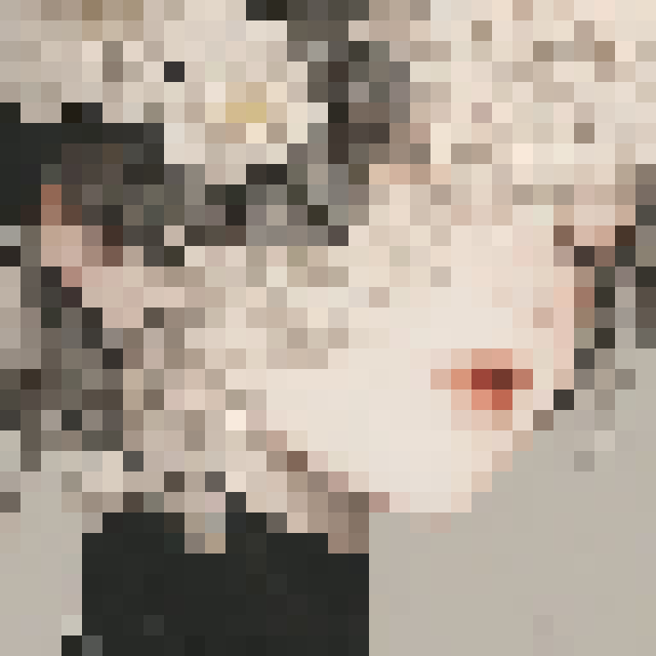

# MAKE PIXEL IMAGE
    A small project for my hobby
---


---
### Fix IMG to name of input image. Image be in your current python file's folder
```py
import numpy as np
import cv2
import os
DIR = os.path.dirname(os.path.realpath(__file__))
IMG = '\\' + 'sam2.jpg'
img = cv2.imread(DIR + IMG)
SIZE = 32
```
### Fix SIZE for the pixel scale, the smaller the SIZE the bigger the pixels

Samples |Origin |Result 32 |Result 64 |Result 128
:-:|:-:|:-:|:-:|:-:
1 | | | |
2 | | | |